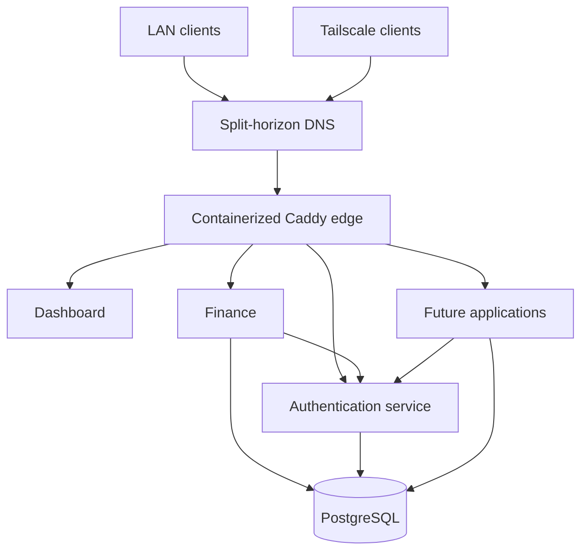

# Pior Labs Platform

Pior Labs is a collection of self-hosted productivity tools built around a shared technical foundation.

What began as a finance-tracking application grew into a broader platform. Each new application exposed another gap to solve: private hosting, reliable deployment, consistent design, shared authentication, networking, observability, and maintainable automation.

This repository documents how those pieces fit together. It describes the public architecture, repository boundaries, platform conventions, and roadmap. Production configuration and operational details remain in the private `platform-deploy` repository.

## Goals

- Keep personal application data under direct control.
- Give applications a consistent design, authentication, and deployment foundation.
- Keep applications independently developable and deployable.
- Separate public architecture from private production operations.
- Build repeatable patterns that make future applications easier to add.
- Use AI-assisted development without sacrificing understanding, security, or maintainability.

## Current state

The core platform foundation is operational:

- Dashboard, Finance, and the shared Auth service are deployed on the self-hosted server.
- A containerized Caddy edge handles application routing and TLS.
- Split-horizon DNS allows the same `*.szarans.ca` hostnames to work on the local network and over Tailscale.
- PostgreSQL provides shared database infrastructure with application-specific databases and roles.
- `service-auth` provides centralized OAuth 2.1 / OpenID Connect SSO.
- Finance has been migrated to the shared authentication, networking, and database model.
- The shared design system is published through GitHub Packages and consumed by applications.
- Production infrastructure and routing configuration are maintained separately in the private `platform-deploy` repository.
- Production deployments use dedicated, repository-scoped self-hosted runners on the server.

## Local application development

User-facing applications share one browser-origin convention:

- run one application at a time on `http://localhost:5173`;
- proxy `/api/*` from Vite to that application's local API port;
- authenticate against the hosted canonical issuer at
  `https://auth.szarans.ca/api/auth`;
- register `http://localhost:5173/api/auth/oauth2/callback/auth-pior` on every
  development-enabled OAuth client; and
- configure a distinct Better Auth `cookiePrefix` for every application.

Cookies are scoped by hostname rather than port and survive after a development
server stops. A unique prefix such as `finlens` or `cookbook` prevents session
and OAuth-state cookies from one local application being interpreted by
another.

Running `service-auth` locally remains useful when developing the identity
provider itself. Normal application development uses the hosted service and
does not require the local Auth web/API processes.

## Architecture

Applications use stable `szarans.ca` hostnames regardless of whether the client is on the trusted local network or connected through Tailscale. Caddy is the platform entry point, application-facing containers communicate over shared Docker networking, and stateful services use isolated PostgreSQL credentials.

## Repository model

| Prefix or repository | Responsibility |
| --- | --- |
| `app-*` | User-facing applications |
| `service-*` | Independently deployed shared services |
| `package-*` | Reusable libraries and packages |
| `platform` | Public architecture and platform documentation |
| `platform-deploy` | Private production deployment, routing, database provisioning, and operational configuration |
| `.github` | Organization profile and shared GitHub configuration |
| `template-webapp` | Reusable starting point for new platform applications |

## Current direction

The original platform migration is complete. Current work is focused on extending and hardening the established foundation:

1. Use the standardized application pattern for new projects, beginning with the Cookbook.
2. Continue reducing production-specific deployment logic inside public application repositories.
3. Standardize observability and deployment verification across services.
4. Document and automate backup and restore procedures.
5. Expand reusable platform conventions as new applications introduce common requirements.
6. Add an MCP-enabled assistant after the application ecosystem is established.

## Documentation

- [Architecture](docs/architecture.md)
- [Repository model](docs/repository-model.md)
- [Deployment model](docs/deployment.md)
- [Networking](docs/networking.md)
- [Security](docs/security.md)
- [Roadmap](docs/roadmap.md)
- [New web application bootstrap prompt](prompts/new-webapp-bootstrap.md)

## Status

The core Pior Labs self-hosted platform foundation is operational and under active development. Remaining roadmap items are improvements and new capabilities rather than prerequisites for the current applications to run on the shared platform.
