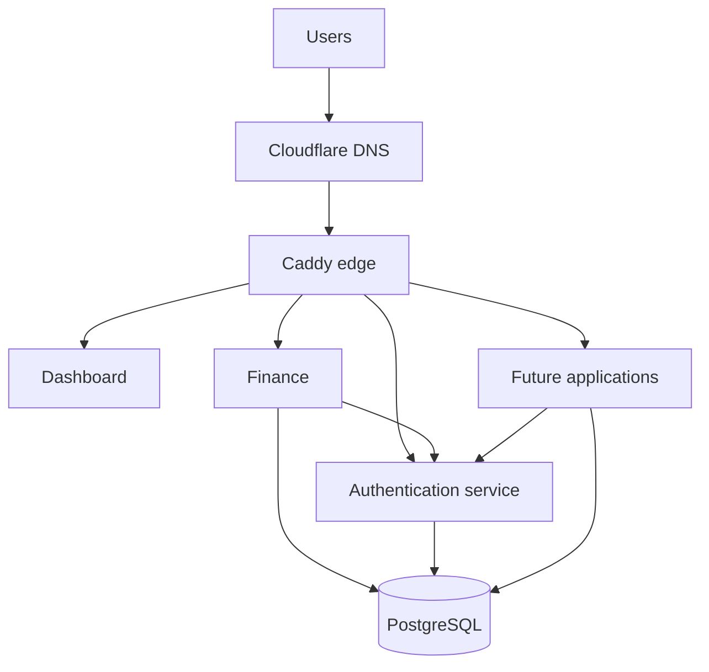

# Pior Labs Platform

Pior Labs is a collection of self-hosted productivity tools built around a shared technical foundation.

What began as a finance-tracking application grew into a broader platform. Each new application exposed another gap to solve: private hosting, reliable deployment, consistent design, shared authentication, networking, observability, and maintainable automation.

This repository documents how those pieces fit together. It describes the public architecture, repository boundaries, platform conventions, and migration roadmap. Production configuration and operational details remain in the private `platform-deploy` repository.

## Goals

- Keep personal application data under direct control.
- Give applications a consistent design, authentication, and deployment foundation.
- Keep applications independently developable and deployable.
- Separate public architecture from private production operations.
- Build repeatable patterns that make future applications easier to add.
- Use AI-assisted development without sacrificing understanding, security, or maintainability.

## Current state

- Dashboard and Finance are deployed on a self-hosted server.
- PostgreSQL provides shared database infrastructure.
- Caddy currently handles application routing and TLS.
- Tailscale provides private remote access.
- The shared design system is published through GitHub Packages.
- Finance still uses application-specific authentication.
- Deployment responsibilities are being moved out of application repositories.

## Target architecture

The target platform uses a containerized Caddy edge proxy, a shared private Docker network, central authentication, PostgreSQL-backed services, and GitHub Actions for CI/CD.

## Repository model

| Prefix or repository | Responsibility |
| --- | --- |
| `app-*` | User-facing applications |
| `service-*` | Independently deployed shared services |
| `package-*` | Reusable libraries and packages |
| `platform` | Public architecture and platform documentation |
| `platform-deploy` | Private production deployment and routing configuration |
| `.github` | Organization profile and shared GitHub configuration |

## Current migration

1. Move application hostnames to `szarans.ca`.
2. Introduce the containerized Caddy edge proxy.
3. Connect existing applications to the shared edge network.
4. Move production coordination into `platform-deploy`.
5. Deploy `service-auth` to production.
6. Migrate Finance to shared SSO.
7. Reuse the resulting pattern for future applications.

## Documentation

- [Architecture](docs/architecture.md)
- [Repository model](docs/repository-model.md)
- [Networking](docs/networking.md)
- [Roadmap](docs/roadmap.md)

## Status

Pior Labs is under active development. This repository documents both the current implementation and the accepted target architecture; planned components are labelled accordingly.
