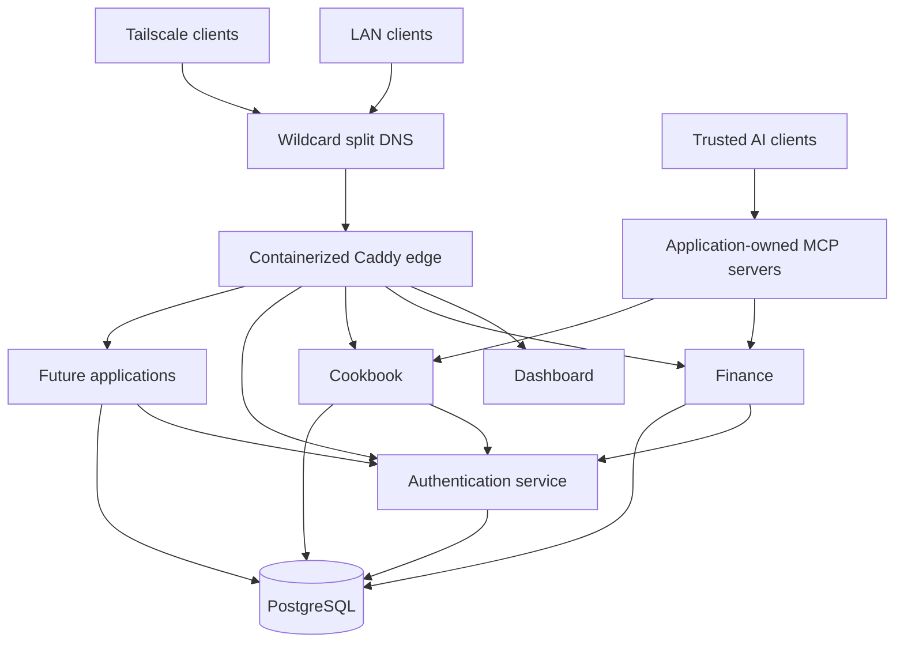

# Pior Labs Platform

Pior Labs is a collection of self-hosted household productivity applications built around a shared technical foundation.

What began as a finance-tracking application grew into a broader platform. Each new application exposed another gap to solve: private hosting, reliable deployment, consistent design, shared authentication, networking, observability, reusable application patterns, and maintainable automation.

This repository documents how those pieces fit together. It describes the public architecture, repository boundaries, platform conventions, and roadmap. Production configuration and operational details remain in the private `platform-deploy` repository.

## Goals

- Keep personal application data under direct control.
- Give applications a consistent design, authentication, and deployment foundation.
- Keep applications independently developable and deployable.
- Separate public architecture from private production operations.
- Build repeatable patterns that make future applications easier to add.
- Expose useful application capabilities to trusted AI assistants through narrow, application-owned MCP interfaces.
- Use AI-assisted development without sacrificing understanding, security, or maintainability.

## Current state

The core platform foundation is operational and is now supporting multiple real applications:

- [Dashboard](https://github.com/pior-labs/app-dashboard), [Finance](https://github.com/pior-labs/app-finance-tracker), [Cookbook](https://github.com/pior-labs/app-cookbook), and the shared Auth service are deployed on the self-hosted server.
- Cookbook was built from the standardized application template and has completed its Phase 1 recipe-management experience, including search/discovery, images, serving scaling, favorites, ratings, Trash, and Cooking Mode.
- Cookbook also exposes a read-only MCP v1 for recipe search, retrieval, favorites, ratings-oriented discovery, tags, and serving scaling.
- A containerized Caddy edge handles application routing and TLS.
- Wildcard split-horizon DNS allows every `*.szarans.ca` hostname to work on the local network and over Tailscale without per-application DNS records.
- PostgreSQL provides shared database infrastructure with application-specific databases and roles.
- `service-auth` provides centralized OAuth 2.1 / OpenID Connect SSO.
- Finance and Cookbook use the shared authentication, networking, and database model.
- The shared design system is published through GitHub Packages and consumed by applications.
- Production infrastructure and routing configuration are maintained separately in the private `platform-deploy` repository.
- Production deployments use dedicated, repository-scoped self-hosted runners on the server.

## Applications

| Application | Repository | Purpose |
| --- | --- | --- |
| Dashboard | [`app-dashboard`](https://github.com/pior-labs/app-dashboard) | Home entry point for the platform and its applications |
| Finance | [`app-finance-tracker`](https://github.com/pior-labs/app-finance-tracker) | Private household finance tracking and analysis |
| Cookbook | [`app-cookbook`](https://github.com/pior-labs/app-cookbook) | Shared household recipes, cooking workflows, and future meal planning |

Shared services and packages remain independently deployed or published so applications can evolve without becoming one monolith.

## Local application development

User-facing applications share one browser-origin convention:

- run one application at a time on `http://localhost:5173`;
- proxy `/api/*` from Vite to that application's local API port;
- authenticate against the hosted canonical issuer at `https://auth.szarans.ca/api/auth`;
- register `http://localhost:5173/api/auth/oauth2/callback/auth-pior` on every development-enabled OAuth client; and
- configure a distinct Better Auth `cookiePrefix` for every application.

Cookies are scoped by hostname rather than port and survive after a development server stops. A unique prefix such as `finlens` or `cookbook` prevents session and OAuth-state cookies from one local application being interpreted by another.

Running `service-auth` locally remains useful when developing the identity provider itself. Normal application development uses the hosted service and does not require the local Auth web/API processes.

## Architecture

Applications use stable `szarans.ca` hostnames regardless of whether the client is on the trusted local network or connected through Tailscale. Cloudflare and Tailscale wildcard rules cover new subdomains automatically; Caddy remains the explicit application entry point. Application-facing containers communicate over shared Docker networking, and stateful services use isolated PostgreSQL credentials.

MCP is intentionally application-owned rather than a second data layer: assistants consume narrow capabilities exposed by each application, while business rules remain in the application itself.

## Repository model

| Prefix or repository | Responsibility |
| --- | --- |
| `app-*` | User-facing applications |
| `service-*` | Independently deployed shared services |
| `package-*` | Reusable libraries and packages |
| `platform` | Public architecture and platform documentation |
| `platform-deploy` | Private production deployment, routing, database provisioning, and operational configuration |
| `.github` | Organization profile and shared GitHub configuration |
| `template-webapp` | Reusable starting point for new platform applications |

## Current direction

The platform is moving from **foundation-building** into **application capability and integration**.

The standardized paved road has now been proven by building Cookbook from the template through production deployment. Current work is focused on deepening the useful household applications while continuing to improve the platform underneath them:

1. Extend Cookbook beyond recipe storage into ad-hoc meal planning and grocery-list generation while keeping its existing Phase 1 experience stable.
2. Expand application-owned MCP interfaces as new capabilities become useful to conversational workflows, rather than waiting for one large assistant project to define every integration.
3. Use the application template, shared auth, design system, database conventions, and deployment model as the default path for future apps.
4. Continue reducing production-specific deployment responsibilities inside public application repositories.
5. Standardize observability, deployment verification, backup, and restore procedures across applications and services.
6. Build a broader Pior Labs assistant on top of the application MCP layer once enough useful cross-application capabilities exist.

The goal is no longer simply to prove that multiple applications can share a platform. The next stage is to make those applications work together as a coherent household productivity system without sacrificing independent ownership or deployment.

## Documentation

- [Architecture](docs/architecture.md)
- [Repository model](docs/repository-model.md)
- [Deployment model](docs/deployment.md)
- [Networking](docs/networking.md)
- [Security](docs/security.md)
- [Roadmap](docs/roadmap.md)
- [New web application bootstrap prompt](prompts/new-webapp-bootstrap.md)

## Status

The core Pior Labs self-hosted platform foundation is operational and in regular use. New work is primarily application expansion, cross-application integration, and platform hardening rather than prerequisite infrastructure needed to make the current applications run.
