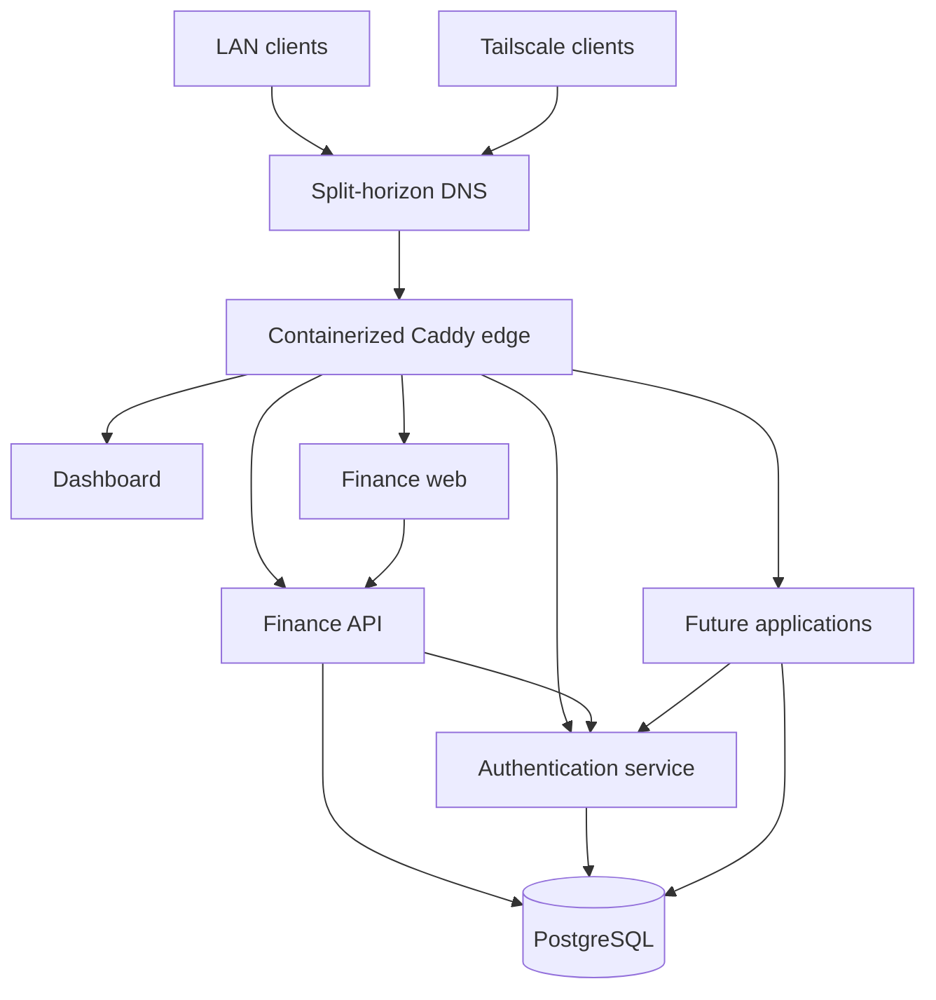

# Architecture

## Purpose

Pior Labs provides a shared foundation for independently developed self-hosted applications. It centralizes capabilities that should not be rebuilt by every project: routing, TLS, authentication, deployment conventions, shared packages, and database infrastructure.

## Scope

The platform runs on a home server and is intended primarily for personal and household use. Applications are available over the trusted local network and Tailscale rather than being operated as public SaaS products.

## Current architecture

The core platform architecture is operational.

- Dashboard, Finance, and Auth run as independently deployable services.
- A containerized Caddy service handles routing and HTTPS.
- Split-horizon DNS provides one stable `szarans.ca` hostname per service across LAN and Tailscale access.
- `service-auth` provides central OAuth 2.1 / OpenID Connect authentication.
- Finance uses the central Auth service for SSO.
- PostgreSQL provides shared database infrastructure with separate application databases and roles.
- Application-facing containers join the shared `pior_edge` network for Caddy routing.
- GitHub Actions handles CI/CD, while private production configuration remains separated from public application source.

## Component responsibilities

### Caddy edge

The shared Caddy service owns hostname routing, HTTPS certificate management, Cloudflare DNS challenges, and forwarding traffic to application containers over the private platform edge network.

Caddy is the normal browser and API entry point for hosted applications. Application services may retain loopback-only host bindings for diagnostics or deployment compatibility, but they are not intended as external access paths.

### Applications

Each application repository owns its source code, tests, containers, database migrations, health endpoints, and application release process. Applications expose only the services required by Caddy or other trusted platform components.

New applications should begin from the established platform conventions instead of recreating networking, authentication, or deployment structure independently.

### Authentication service

`service-auth` is the central identity provider. It provides a shared sign-in experience using OAuth 2.1 / OpenID Connect while allowing each application to retain its own domain-specific users, data, and authorization rules.

Finance is the first existing application migrated to this model.

### PostgreSQL

PostgreSQL is the standard relational database for stateful applications. Applications use separate logical databases and dedicated roles so access remains isolated even when infrastructure is shared.

Production database provisioning and credentials are managed by the private platform deployment layer rather than documented in public repositories.

### Shared packages

Reusable code belongs in `package-*` repositories when it has a clear cross-application contract. The design system provides common React components, tokens, and visual conventions used across Pior Labs applications.

### GitHub Actions and deployment

Application repositories validate and build their own code. Production deployment is automated through self-hosted infrastructure, while production routing, database provisioning, and operational configuration are maintained in the private `platform-deploy` repository.

Further reducing production-specific logic and credentials inside public application repositories remains an active hardening goal.

## Trust boundaries

1. Public DNS can describe service names without making the applications publicly reachable.
2. Application access is limited to trusted LAN clients and authenticated Tailscale devices.
3. Only required application-facing containers join the shared edge network.
4. Each service receives only the database access it requires.
5. Architecture and conventions are public; operational configuration and secrets remain private.
6. Docker and production runner access are treated as privileged capabilities.

## Platform evolution

The original migration path—new domains, containerized Caddy, shared networking, Auth deployment, and Finance SSO—is complete. The architecture now evolves incrementally through new applications and hardening work rather than through a second migration target.

Current priorities include:

- using the standardized foundation for new applications
- reducing production-specific responsibilities in public repositories
- improving deployment verification and observability
- standardizing backup and restore procedures
- expanding reusable platform contracts when common requirements emerge

## Related documentation

- [Repository model](repository-model.md)
- [Networking](networking.md)
- [Security](security.md)
- [Roadmap](roadmap.md)
