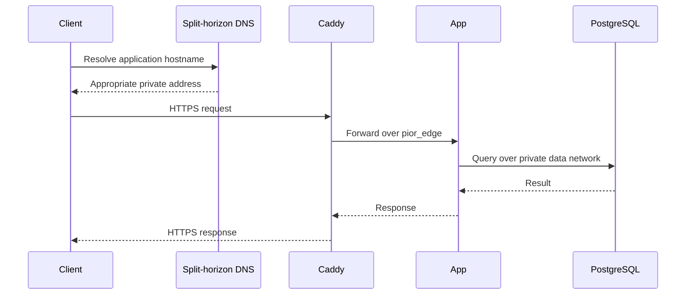

# Networking

## Overview

Pior Labs uses Cloudflare for authoritative DNS and certificate validation, split-horizon DNS for private address resolution, Caddy as the shared application edge, Docker networks for service-to-service communication, and Tailscale for private remote access.

The design keeps application traffic private while still using stable domain names and publicly trusted HTTPS certificates.

## Hostname model

Each service has one canonical hostname under `szarans.ca`. The same hostname is used whether the client is on the trusted local network or connected through Tailscale.

Current routing contracts include:

```text
szarans.ca
finance.szarans.ca
auth.szarans.ca
```

Split-horizon DNS returns the appropriate private address for the client's network context, so separate `.ts.szarans.ca` hostnames are no longer required.

## DNS

Cloudflare remains authoritative for the public `szarans.ca` zone and is used by Caddy for ACME DNS-01 certificate validation.

Inside trusted networks, the platform DNS layer overrides application hostnames with private addresses appropriate to LAN or Tailscale access. This provides a consistent URL while keeping traffic on private network paths.

Public DNS records do not make the services publicly reachable by themselves. No private IP addresses are documented in this public repository.

## HTTPS

Caddy obtains publicly trusted certificates using the ACME DNS-01 challenge through a scoped Cloudflare API token.

DNS-01 allows private services to receive valid certificates without requiring a publicly reachable HTTP validation endpoint. The custom Caddy image includes the Cloudflare DNS provider module.

The API token is limited to the `szarans.ca` zone and is stored only in protected deployment configuration. It is never committed to a public repository.

## Edge routing

Caddy is the platform entry point for browser and API traffic.

The current routing model is:

- Caddy publishes the platform HTTPS entry point on the host.
- Caddy routes requests to application containers over the shared `pior_edge` network.
- Hostname routing is maintained by `platform-deploy` rather than duplicated across application repositories.
- Application services are not intended to be accessed through directly exposed network ports. Loopback-only bindings may remain for diagnostics or deployment compatibility.

## Docker network contract

Application-facing containers join the external Docker network:

```text
pior_edge
```

Current network aliases include:

| Application | Web alias | API alias |
| --- | --- | --- |
| Dashboard | `dashboard-web` | — |
| Finance | `finance-web` | `finance-api` |
| Auth | `auth-web` | `auth-api` |

Aliases must be unique across the platform and should describe the application and component rather than a particular container instance.

Databases and internal-only services should not join `pior_edge` unless Caddy or another trusted platform component must reach them directly.

## Request flow



## Access paths

### Local network

A trusted LAN client resolves the normal `szarans.ca` application hostname to the server's LAN-reachable private address.

### Tailscale

A Tailscale-connected client uses the same application hostname, but split DNS resolves it to the server's Tailscale-reachable private address.

This avoids separate bookmarks, OAuth redirect URIs, and application configuration for LAN and remote private access.

## Security model

Networking is one layer of the broader platform security model. Access restrictions, credential handling, CI/CD isolation, host controls, database separation, and current limitations are documented in [Security](security.md).

## Related documentation

- [Architecture](architecture.md)
- [Repository model](repository-model.md)
- [Security](security.md)
- [Roadmap](roadmap.md)
