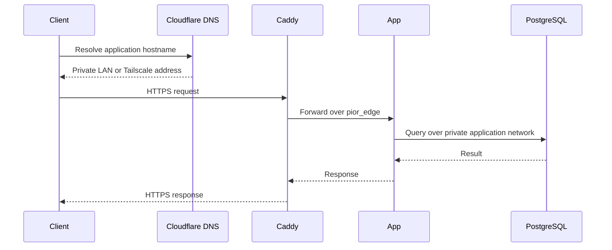

# Networking

## Overview

Pior Labs uses Cloudflare for authoritative DNS, Caddy as the shared application edge, Docker networks for service-to-service communication, and Tailscale for private remote access.

The design keeps application traffic private while still using stable domain names and publicly trusted HTTPS certificates.

## Hostname model

Each application may have two private access names:

| Access path | Pattern | Example |
| --- | --- | --- |
| Local network | `<app>.szarans.ca` | `finance.szarans.ca` |
| Tailscale | `<app>.ts.szarans.ca` | `finance.ts.szarans.ca` |

Current routing contracts include:

```text
dashboard.szarans.ca
dashboard.ts.szarans.ca
finance.szarans.ca
finance.ts.szarans.ca
auth.szarans.ca
auth.ts.szarans.ca
```

The `*.ts.szarans.ca` names are intended as canonical private-production URLs. Plain `*.szarans.ca` names may remain convenient LAN aliases.

## DNS

Cloudflare records for LAN and Tailscale services remain DNS-only because they resolve to private addresses that Cloudflare's public proxy cannot reach.

Application names may use CNAME records that point to shared LAN and Tailscale host records. The target record is an implementation detail and does not become part of the URL users visit.

No private IP addresses are documented in this public repository.

## HTTPS

Caddy obtains publicly trusted certificates using the ACME DNS-01 challenge through a scoped Cloudflare API token.

DNS-01 is required because the private server is not publicly reachable for HTTP-01 or TLS-ALPN validation. The custom Caddy image includes the Cloudflare DNS provider module.

The API token is limited to the `szarans.ca` zone and is stored only in protected deployment configuration. It is never committed to a repository.

## Edge routing

Caddy is the platform entry point for browser and API traffic.

In the target state:

- Caddy publishes host ports `80` and `443`.
- Applications do not publish their web ports directly to the host.
- Caddy routes requests to containers over the shared `pior_edge` network.
- Hostname routing is maintained by `platform-deploy` rather than duplicated across application repositories.

## Docker network contract

Application-facing containers join the external Docker network:

```text
pior_edge
```

Initial network aliases are:

| Application | Web alias | API alias |
| --- | --- | --- |
| Dashboard | `dashboard-web` | — |
| Finance | `finance-web` | `finance-api` |
| Auth | `auth-web` | `auth-api` |

Aliases must be unique across the platform and should describe the application and component rather than a particular container instance.

Databases and internal-only services should not join `pior_edge` unless Caddy or another edge component must reach them directly.

## Request flow



## Security model

Networking is one layer of the broader platform security model. Access restrictions, credential handling, CI/CD isolation, host controls, database separation, and current limitations are documented in [Security](security.md).
